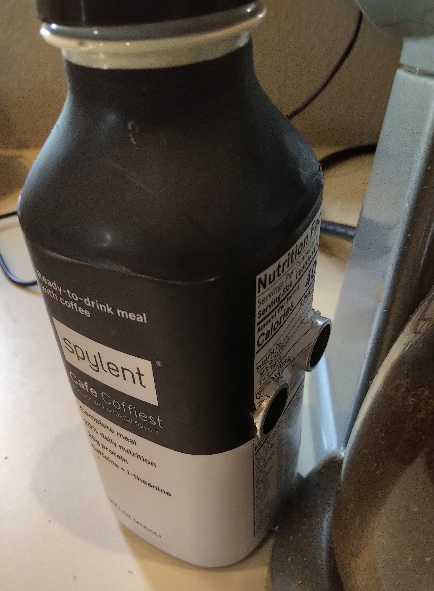

# spylent
A device that messages a Slack channel when coffee is being made (Hackathon Project)

Hardware:
- A raspberry pi zero W, running [balena](https://www.balena.io/)
- An ultrasonic sensor on pins 18 and 24
- An API server for running the rust code that notifies slack
- 1 soylent container

